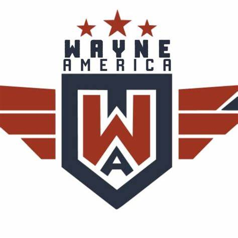

# wayneamerica-flyin

This scenery project is to simulate (with some creative freedom) the WayneAmerica Fly In event that's hosted at Wayne Municipal Airport (LCG) in Nebraska each year. At the airport is also a National STOL Competition; a thrilling aviation event that attracts pilots from across the country to showcase their Short Takeoff and Landing (STOL) skills. Against the backdrop of Wayne's picturesque scenery, competitors engage in high-stakes contests, demonstrating their precision and expertise in navigating the challenging course.

## WayneAmerica Fly In

The WayneAmerica Fly In is an annual event in Wayne, Nebraska, where aviation enthusiasts and pilots come together to celebrate all things flight. From vintage aircraft displays to thrilling aerial demonstrations, it's a gathering that combines history, technology, and a shared love of aviation. Whether you're a seasoned pilot or simply fascinated by the wonders of flight, the WayneAmerica Fly In promises an unforgettable experience that captures the spirit of adventure and innovation in the skies.

## Dependencies

- https://flightsim.to/file/17182/totof-aircraft-library-v1-1
- https://flightsim.to/file/33166/animated-humans-library
- https://flightsim.to/file/58428/stol-runway-marker-library

## References

1. https://www.facebook.com/WayneAmericaFlyin/
1. https://skyvector.com/airport/LCG/Wayne-Municipal-Stan-Morris-Field-Airport